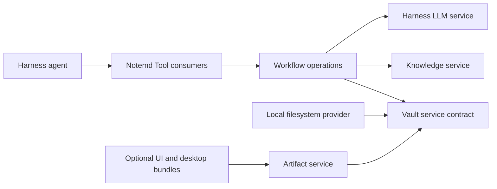

# Notemd DeepSeek Harness Bundle Design

## Decision

Build Notemd as a standalone DeepSeek Harness bundle. The bundle owns note-workflow semantics and operates on an explicitly configured workspace root; it does not require Obsidian, `App`, `TFile`, `Notice`, editor state, or the Obsidian command registry.

The first runnable release delivers all core workflows as Harness services and Tools. Desktop-only export, preview, and compiler integrations are optional bundles, not hidden dependencies of the baseline runtime.

## Why This Boundary

`src/main.ts` in the source project is an Obsidian composition root, not portable product logic. Directly moving it would retain the host lifecycle, UI state, and Vault assumptions that make the bundle non-standalone. Conversely, rewriting each command independently would discard the typed operation contracts already present in `src/operations/`.

The migration therefore preserves workflow intent and contracts while replacing host adapters at the edge:



This follows the Harness Service Definition / Provider / Consumer seam. Packages are split only where providers can be independently replaced or lifecycle ownership differs.

## Scope

### Included In The Baseline Bundle

- Explicit workspace selection, Markdown and supported input discovery, safe reads, revision-aware writes, and workspace watching.
- Existing note-processing semantics: wiki-linking, concept extraction, title generation, translation, research synthesis, Mermaid and formula repair, duplicate handling, and batch workflows.
- Portable local knowledge indexing based on the existing MiniSearch behavior.
- Diagram specification, renderer selection, artifact generation, source persistence, and source-level export.
- Provider diagnostics, generic OpenAI-compatible provider support, model discovery where the provider supports it, response caching, cancellation, and structured error reporting.
- Persistent jobs, bounded concurrency, cancellation, resumability, and explicit write approval.
- Harness Tools for read, plan, write, artifact, and job observation.

### Optional Bundles

- Browser-backed visual preview and interactive artifact review.
- Slidev, PPTX, PDF, SVG, PNG, Drawnix, Draw.io, and Circuitikz runtime integrations.
- Desktop process execution and managed external runtimes such as Tectonic.

Optional bundles may consume the artifact contract, but baseline workflows must still generate portable source artifacts and report an actionable unavailable-capability result when an optional provider is absent.

### Explicitly Excluded

- Obsidian plugin loading, `main.ts`, settings tabs, sidebars, modals, command-palette registration, active-editor state, and `TFile`/`TFolder` types.
- An Obsidian compatibility bridge in the standalone bundle. A future bridge is a separate consumer bundle and must depend on the same services and Tools as every other host.
- One-off ports of all legacy provider transports before the generic adapter is contract-complete.

## Workspace Layout

The clean repository is a pnpm workspace rooted at `E:\convert\undo\notemd-deepseek-harness`.

```text
notemd-deepseek-harness/
  packages/
    notemd-vault/
    notemd-vault-local/
    notemd-jobs/
    notemd-knowledge/
    notemd-workflows/
    notemd-artifacts/
    notemd-llm-openai-compatible/
    notemd-tools/
    notemd-bundle/
  profiles/notemd/
  fixtures/
  docs/
  pnpm-workspace.yaml
```

`notemd-vault` defines the file, revision, write-plan, and artifact contracts. `notemd-vault-local` is the initial local filesystem provider. `notemd-tools` is a Consumer; it must not call Node filesystem APIs directly. `notemd-bundle` is the publishable `dsh.bundle` package and contains no mutable runtime state.

No package is created merely to mirror a source folder. A package boundary exists only when it protects a service contract, a replaceable provider, or an independently loadable optional capability.

## Core Services

| Service | Owner | Required invariants |
| --- | --- | --- |
| `notemdVault` | `notemd-vault` contract and a provider | All paths remain under an approved workspace root after canonical resolution; writes require an expected revision or an approved creation precondition. |
| `notemdJobs` | `notemd-jobs` | A run has an idempotency key, immutable input snapshot, cancellation signal, bounded parallelism, and one terminal result per target. |
| `notemdKnowledge` | `notemd-knowledge` | The index is derived data. It can be rebuilt from workspace files and never becomes the source of truth. |
| `notemdArtifacts` | `notemd-artifacts` | Every artifact records source, renderer, revision, and ownership metadata; cleanup only removes manifest-owned outputs. |

Each provider is a `Service` subclass. Consumers declare `inject` for every service they require. A provider removal therefore disposes dependent consumers before a replacement is loaded. No module-level singleton may hold file handles, timers, caches, watchers, or process handles across Fiber disposal.

## Tool Contract

Tools are divided by authority, not by a `mode` argument:

- Read Tools: inspect workspace files, knowledge matches, provider diagnostics, jobs, and artifacts.
- Plan Tools: produce a deterministic target set, content diff, revision preconditions, estimated model calls, and approval requirement.
- Write Tools: apply one approved plan with per-file result records; they reject stale revisions and never infer approval from a prior read.
- Artifact Tools: create source artifacts and request optional rendering through injected providers.

Every write result is explicit: `created`, `updated`, `skipped-stale`, `rejected`, `cancelled`, or `failed`. Batch operations return per-target results rather than a count-only success signal.

The agent can compose atomic tools for new workflows, but high-stakes mutations remain gated by an approval token tied to the exact planned diff and workspace revision. This gives Harness agent parity without allowing a vague natural-language request to become an unreviewed bulk rewrite.

## Storage And Security

Package installation directories are immutable at runtime. Durable, workspace-scoped operational state belongs under `<workspace>/.notemd/`; user-visible content remains in the workspace itself. Machine-local caches, logs, downloaded runtimes, and credential references belong below `$DSH_HOME/data/notemd/`, never under `node_modules` or the bundle directory.

`notemd-vault-local` validates relative paths once at its public boundary, resolves symlinks and junctions before access, rejects path escape, uses sibling temporary files plus atomic replace, and serializes competing writes per canonical file. On Windows, transient replacement failures receive bounded retry with diagnostics; they do not silently downgrade to non-atomic writes.

Credentials are profile-local references or Harness-supported secret inputs. Bundle patch files, fixtures, job records, diagnostics, exports, and committed configuration never contain provider keys. Existing Notemd `localOnly` intent maps to device-local profile configuration, not a syncable workspace file.

## LLM Migration

The first adapter is a generic OpenAI-compatible Harness adapter. It must implement the complete `StreamChunk` protocol, forward cancellation signals, preserve tool-call blocks, emit usage before `finish`, and throw stable `LlmError` codes. This replaces the source plugin's direct `requestUrl` dependency.

Porting all provider-specific paths first is rejected. The source currently has transport-specific behavior, token limits, caching, headers, retries, and diagnostics. Migrating it line-for-line would produce a second incompatible provider framework beside Harness. Provider-specific adapters are added only after contract tests demonstrate that a source behavior cannot be expressed by the generic adapter.

## Configuration And Packaging

The published package declares `dsh.bundle` and contributes a `cordis.patch.yml`. A user profile composes the base bundle, the Notemd bundle, user overrides, home-level machine preferences, and explicit `--patch` overlays.

Patch layers replace an entire target `config` value instead of deep-merging it. Bundle defaults must therefore be self-contained, schemas must provide defaults and validate all deployment-varying values, and profile examples must restate every field needed by an overridden row.

The default profile carries no secrets and no machine paths. It is a runnable development profile backed by fixture workspaces. A real workspace root, credential reference, and optional desktop runtime are profile-level deployment decisions.

## Source Migration Map

| Source area | Destination | Migration rule |
| --- | --- | --- |
| `src/operations/` | `notemd-workflows` and `notemd-tools` | Preserve operation ids, input/output schemas, side-effect classifications, and result contracts; replace Obsidian host adapters. |
| `src/fileUtils.ts` | Vault service plus narrow workflows | Split reads, planning, mutations, and UI notice shaping. Do not move its `App` coupling. |
| `src/localKnowledgeBase.ts` | `notemd-knowledge` | Preserve MiniSearch semantics, make indexing incremental, and rebuild from files after invalidation. |
| `src/llmProviders.ts` and `src/llmUtils.ts` | Harness adapter packages | Map transport behavior to Harness contracts; do not retain a parallel provider registry. |
| `src/diagram/` and `src/rendering/` | `notemd-artifacts` plus optional renderer bundles | Retain the spec-first artifact boundary; remove modal and iframe ownership from the core. |
| `src/slideExport/` and Tectonic code | Optional desktop/export bundles | Load only through declared service dependencies. |
| `src/ui/`, `src/main.ts` | Not migrated | They are Obsidian host composition, not reusable domain behavior. |

## Migration Sequence

1. Establish contracts, local vault provider, lifecycle tests, fixture workspace, and a development profile.
2. Move read-only operations and knowledge indexing; prove output parity against source fixtures.
3. Introduce plan/write operations with revision and approval contracts; migrate note processing and batch execution.
4. Add the generic LLM adapter, diagnostics, and cancellation conformance tests.
5. Move diagrams and portable source artifacts; then attach optional renderers and desktop exporters.
6. Migrate remaining provider-specific behavior only when capability gaps are demonstrated.
7. Publish a packed bundle, install it into a clean profile, and validate unload/reload, profile layering, secrets isolation, and cross-platform filesystem behavior.

## Verification Strategy

- Lifecycle contract tests: registration, watchers, timers, tools, adapters, and child plugins disappear on Fiber disposal and reappear exactly once after dependency restoration.
- Vault contract tests: path containment, junction/symlink escape, stale revision rejection, atomic write behavior, concurrent writers, and Windows replacement diagnostics.
- Workflow golden tests: source fixtures exercise equivalent outputs without Obsidian mocks.
- Tool contract tests: schema validation, approval binding, per-file batch results, cancellation, and idempotent resume.
- LLM stream conformance: text blocks, tool-call blocks, usage, finish order, cancellation, and stable errors.
- Bundle acceptance: `pnpm pack`, clean-profile installation, `dsh --dump-config`, Web UI tool invocation, and uninstall/reinstall without residual state.

## Risks And Rejected Alternatives

- A one-to-one Obsidian UI port is rejected: UI parity is not workflow parity and would block standalone operation behind host-specific state.
- An Obsidian bridge as the core runtime is rejected: it makes Harness a command trigger rather than the owner of lifecycle, Tools, jobs, and configuration.
- A single mega-plugin is rejected: it prevents provider replacement, makes HMR failures non-local, and creates unclear disposal ownership.
- A fully split package graph on day one is also rejected: service seams should be earned by replacement or lifecycle needs, not copied from source folders.
- "Complete latest content with no omissions" is not a defensible guarantee for changing upstream websites. The implementation instead pins DeepSeek Harness/Cordis versions, records source references, and contract-tests the exact APIs used.

## Evidence

- DeepSeek Harness: [plugins and lifecycle](https://deepseek-harness.github.io/deepseek-harness/develop/framework/), [services](https://deepseek-harness.github.io/deepseek-harness/develop/framework/service), [Tool development](https://deepseek-harness.github.io/deepseek-harness/develop/basic/tool), [bundles and profiles](https://deepseek-harness.github.io/deepseek-harness/develop/basic/publish), and [LLM adapters](https://deepseek-harness.github.io/deepseek-harness/develop/practice/llm-adapter).
- Koishi: [disposability](https://koishi.chat/zh-CN/cookbook/design/disposable.html), [zero-occupation storage](https://koishi.chat/zh-CN/cookbook/design/storage.html), and [bundle practice](https://koishi.chat/zh-CN/cookbook/practice/bundle.html).
- Cordis: [core source](https://github.com/Jacobinwwey/cordis/tree/main/packages/core) and its explicit instability notice.
- Notemd source baseline: `E:\convert\undo\obsidian-NoteMD_new\docs\architecture.md`, `src/operations/`, `src/fileUtils.ts`, `src/llmUtils.ts`, `src/llmProviders.ts`, `src/localKnowledgeBase.ts`, and `src/diagram/`.
