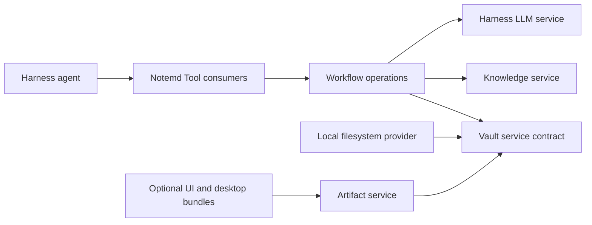

# Notemd DeepSeek Harness Bundle 架构设计

## 决策

将 Notemd 构建为可独立运行的 DeepSeek Harness bundle。该 bundle 以显式配置的工作区根目录为对象，拥有笔记工作流语义；它不依赖 Obsidian、`App`、`TFile`、`Notice`、编辑器状态或 Obsidian 命令注册表。

首个可运行版本交付完整的核心工作流，并以 Harness Service 与 Tool 运行。桌面专属导出、预览和编译器集成作为可选 bundle，而不是基础运行时的隐藏依赖。

## 边界依据

源项目的 `src/main.ts` 是 Obsidian 的组合根，不是可移植的产品逻辑。直接迁移会保留宿主生命周期、UI 状态和 Vault 假设，使 bundle 失去独立运行能力；反过来，逐条重写命令会丢弃 `src/operations/` 已形成的类型化操作契约。

因此迁移保留工作流意图与契约，同时只在边缘替换宿主适配器：



该结构遵循 Harness 的 Service Definition / Provider / Consumer seam。只有可独立替换的提供方或拥有不同生命周期的能力才拆成独立包。

## 范围

### 基础 Bundle 包含

- 显式工作区选择、Markdown 与受支持输入的发现、安全读取、带版本前置条件的写入和工作区监听。
- 既有笔记处理语义：Wiki 链接、概念提取、标题生成、翻译、研究综合、Mermaid 与公式修复、重复项处理及批处理工作流。
- 基于现有 MiniSearch 行为的可移植本地知识索引。
- 图表规格、渲染器选择、工件生成、源文件持久化和源级导出。
- Provider 诊断、通用 OpenAI 兼容提供方支持、在提供方支持时的模型发现、响应缓存、取消和结构化错误。
- 持久化任务、有界并发、取消、可恢复执行和显式写入审批。
- Read、Plan、Write、Artifact 和 Job 观察类 Harness Tool。

### 可选 Bundle

- 基于浏览器的视觉预览和交互式工件审阅。
- Slidev、PPTX、PDF、SVG、PNG、Drawnix、Draw.io、Circuitikz 运行时集成。
- 桌面进程执行及 Tectonic 等受管外部运行时。

可选 bundle 可以消费工件契约，但基础工作流必须仍能生成可移植源工件；如果缺少可选提供方，应返回可执行的能力不可用结果。

### 明确排除

- Obsidian 插件加载、`main.ts`、设置页、侧栏、模态框、命令面板注册、活动编辑器状态，以及 `TFile`/`TFolder` 类型。
- 在独立 bundle 内保留 Obsidian 兼容桥。未来桥接器必须是独立 Consumer bundle，并与其他宿主一样依赖相同服务和 Tool。
- 在通用适配器尚未满足契约前，一次性迁移全部旧 provider 专用传输路径。

## 工作区布局

干净仓库为位于 `E:\convert\undo\notemd-deepseek-harness` 的 pnpm workspace：

```text
notemd-deepseek-harness/
  packages/
    notemd-vault/
    notemd-vault-local/
    notemd-jobs/
    notemd-knowledge/
    notemd-workflows/
    notemd-artifacts/
    notemd-llm-openai-compatible/
    notemd-tools/
    notemd-bundle/
  profiles/notemd/
  fixtures/
  docs/
  pnpm-workspace.yaml
```

`notemd-vault` 定义文件、版本、写入计划和工件契约；`notemd-vault-local` 是首个本地文件系统提供方；`notemd-tools` 是 Consumer，禁止直接调用 Node 文件系统 API；`notemd-bundle` 是发布用 `dsh.bundle` 包，不能拥有可变运行状态。

不为复刻源代码目录而拆包。只有当边界保护服务契约、可替换提供方或可独立加载的可选能力时，才引入包边界。

## 核心服务

| 服务 | 所有者 | 必须保持的约束 |
| --- | --- | --- |
| `notemdVault` | `notemd-vault` 契约及其提供方 | 所有路径经规范化解析后仍位于已批准工作区根下；写入必须携带预期版本或已批准的新建前置条件。 |
| `notemdJobs` | `notemd-jobs` | 每次执行均有幂等键、不可变输入快照、取消信号、有界并行度和每个目标唯一终态结果。 |
| `notemdKnowledge` | `notemd-knowledge` | 索引是派生数据，可由工作区文件重建，绝不能成为事实来源。 |
| `notemdArtifacts` | `notemd-artifacts` | 每个工件记录源、渲染器、版本和所有权元数据；清理只删除由清单证明属于本次生成的输出。 |

每个提供方都是 `Service` 子类。Consumer 为每项必需服务声明 `inject`。因此移除提供方时，依赖它的 Consumer 会先 dispose，再在替换提供方出现后重新加载。禁止模块级单例跨 Fiber disposal 持有文件句柄、定时器、缓存、监听器或进程句柄。

## Tool 契约

Tool 按权限而不是 `mode` 参数划分：

- Read Tool：检查工作区文件、知识匹配、provider 诊断、任务与工件。
- Plan Tool：输出确定的目标集合、内容 diff、版本前置条件、模型调用估算和审批要求。
- Write Tool：执行一个已批准计划，返回每个文件的结果；拒绝过期版本，绝不从此前的读取动作推断审批。
- Artifact Tool：创建源工件，并通过注入的可选提供方请求渲染。

每次写入都有明确结果：`created`、`updated`、`skipped-stale`、`rejected`、`cancelled` 或 `failed`。批处理返回逐目标结果，而不是只返回一个成功数量。

Agent 可以组合原子 Tool 形成新工作流，但高风险修改仍由与精确 diff 和工作区版本绑定的审批令牌控制。这同时实现 Harness 的 agent parity，并避免模糊自然语言请求直接变成未经审阅的大范围改写。

## 存储与安全

包安装目录在运行时不可写。持久、工作区范围的操作状态放在 `<workspace>/.notemd/`；用户可见内容仍在工作区中。机器本地缓存、日志、下载运行时和凭据引用放在 `$DSH_HOME/data/notemd/`，绝不放在 `node_modules` 或 bundle 目录。

`notemd-vault-local` 在公共边界一次性校验相对路径，访问前解析符号链接与 junction，拒绝路径逃逸，使用同目录临时文件加原子替换，并按规范化文件路径串行化竞争写入。Windows 上若原子替换暂时失败，使用有界重试与诊断，不能静默降级为非原子写入。

凭据使用 profile 本地引用或 Harness 支持的 secret 输入。bundle patch、fixtures、任务记录、诊断、导出和被提交配置中都不得有 provider key。现有 Notemd 的 `localOnly` 意图映射为设备本地 profile 配置，而不是可同步的工作区文件。

## LLM 迁移

第一项适配器为通用 OpenAI 兼容 Harness adapter。它必须实现完整 `StreamChunk` 协议，传递取消信号，保留 Tool-call block，在 `finish` 前发出 usage，并抛出稳定 `LlmError` code。这替换源插件对 `requestUrl` 的直接依赖。

拒绝先逐行搬运全部 provider 专用路径。源项目已有传输差异、token 限制、缓存、请求头、重试和诊断；逐行迁移会在 Harness 旁边再造一个不兼容的 provider 框架。只有在通用适配器无法表达源行为且已有契约测试证明缺口时，才添加 provider 专用适配器。

## 配置与打包

发布包声明 `dsh.bundle` 并贡献 `cordis.patch.yml`。用户 profile 按顺序组合基础 bundle、Notemd bundle、用户覆盖、home 级机器偏好和显式 `--patch` overlay。

Patch 层替换目标行的整个 `config` 值，而非深合并。因此 bundle 默认值必须自包含，schema 必须为所有部署差异参数提供默认值和校验，profile 示例在覆盖一行时必须完整重述该行需要的字段。

默认 profile 不携带 secret 和机器路径。它是由 fixture workspace 支撑的可运行开发 profile。真实工作区根、凭据引用和可选桌面运行时均是 profile 层的部署决策。

## 源码迁移映射

| 源区域 | 目标 | 迁移规则 |
| --- | --- | --- |
| `src/operations/` | `notemd-workflows` 与 `notemd-tools` | 保留 operation id、输入/输出 schema、副作用分类和结果契约；替换 Obsidian host adapter。 |
| `src/fileUtils.ts` | Vault 服务及窄工作流 | 拆分读取、计划、修改和 UI notice shaping；绝不迁移其 `App` 耦合。 |
| `src/localKnowledgeBase.ts` | `notemd-knowledge` | 保留 MiniSearch 语义，增量索引，并在失效后从文件重建。 |
| `src/llmProviders.ts` 与 `src/llmUtils.ts` | Harness adapter 包 | 将传输行为映射到 Harness 契约；不保留并行 provider registry。 |
| `src/diagram/` 与 `src/rendering/` | `notemd-artifacts` 与可选 renderer bundle | 保留 spec-first 工件边界；从核心中删除 modal 和 iframe 所有权。 |
| `src/slideExport/` 与 Tectonic 代码 | 可选 desktop/export bundle | 只通过声明的服务依赖加载。 |
| `src/ui/`、`src/main.ts` | 不迁移 | 它们是 Obsidian 宿主组合，而非可复用领域行为。 |

## 迁移顺序

1. 建立契约、本地 vault provider、生命周期测试、fixture workspace 和开发 profile。
2. 迁移只读操作和知识索引，用源项目 fixture 证明输出等价。
3. 引入带版本与审批契约的 plan/write 操作，迁移笔记处理和批处理。
4. 加入通用 LLM adapter、诊断和取消一致性测试。
5. 迁移图表与可移植源工件，再挂接可选渲染器和桌面导出器。
6. 只有在能力缺口已被证明后，才迁移余下 provider 专用行为。
7. 发布 packed bundle，在干净 profile 中安装，验证卸载/重载、profile 分层、secret 隔离和跨平台文件系统行为。

## 验证策略

- 生命周期契约测试：Fiber disposal 后注册、监听器、定时器、Tool、adapter 和子插件均消失；依赖恢复后恰好重建一次。
- Vault 契约测试：路径包含、junction/symlink 逃逸、过期版本拒绝、原子写入、并发写入和 Windows 替换诊断。
- 工作流 golden test：源 fixture 在无 Obsidian mock 的条件下产生等价输出。
- Tool 契约测试：schema 校验、审批绑定、逐文件批处理结果、取消和幂等恢复。
- LLM stream conformance：文本 block、tool-call block、usage、finish 顺序、取消和稳定错误。
- Bundle 验收：`pnpm pack`、干净 profile 安装、`dsh --dump-config`、Web UI Tool 调用和无残留的卸载/重装。

## 风险与拒绝方案

- 拒绝一比一复刻 Obsidian UI：UI parity 不等于工作流 parity，会把独立运行阻塞在宿主专有状态上。
- 拒绝把 Obsidian bridge 作为核心运行时：那会让 Harness 成为命令触发器，而不是生命周期、Tool、任务和配置的所有者。
- 拒绝单一 mega-plugin：它阻止提供方替换，让 HMR 故障无法局部化，也模糊 disposal 所有权。
- 同时拒绝第一天就过度拆包：服务 seam 必须由可替换性或生命周期需求证明，不能照抄源码目录。
- “保证不断变化的上游网站最新且无遗漏”不是可验证承诺。实施时将锁定 DeepSeek Harness/Cordis 版本、记录来源并对实际调用 API 做契约测试。

## 证据

- DeepSeek Harness：[插件与生命周期](https://deepseek-harness.github.io/deepseek-harness/develop/framework/)、[服务](https://deepseek-harness.github.io/deepseek-harness/develop/framework/service)、[开发 Tool](https://deepseek-harness.github.io/deepseek-harness/develop/basic/tool)、[Bundle 与 Profile](https://deepseek-harness.github.io/deepseek-harness/develop/basic/publish)、[LLM 适配器](https://deepseek-harness.github.io/deepseek-harness/develop/practice/llm-adapter)。
- Koishi：[可逆性](https://koishi.chat/zh-CN/cookbook/design/disposable.html)、[零占用存储](https://koishi.chat/zh-CN/cookbook/design/storage.html)、[整合包实践](https://koishi.chat/zh-CN/cookbook/practice/bundle.html)。
- Cordis：[核心源码](https://github.com/Jacobinwwey/cordis/tree/main/packages/core)，并明确标注 API 尚不稳定。
- Notemd 源基线：`E:\convert\undo\obsidian-NoteMD_new\docs\architecture.md`、`src/operations/`、`src/fileUtils.ts`、`src/llmUtils.ts`、`src/llmProviders.ts`、`src/localKnowledgeBase.ts` 与 `src/diagram/`。
