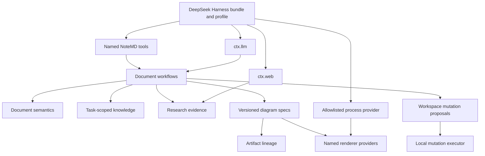

# DSH NoteMD Full Migration Architecture

> Chinese version: [2026-08-15-dsh-notemd-full-migration-architecture.zh-CN.md](2026-08-15-dsh-notemd-full-migration-architecture.zh-CN.md)

**Status:** Approved architecture record. This record supersedes the provider-default and source-artifact-only decisions in the earlier bundle design and next-level runtime records where they conflict.

## 1. Decision

Treat NoteMD as an auditable document-transformation system, not as an Obsidian plugin transplanted into DeepSeek Harness. DSH owns lifecycle, service composition, provider credentials, LLM routing, web-provider selection, tool registration, and profile layering. NoteMD owns document semantics, knowledge retrieval policy, evidence records, mutation proposals, artifact lineage, and renderer-specific exports.

Full migration means behavior-contract parity for every non-Obsidian-host capability in source commit `4168a51cd19ad8c3d1e05f604b50936255461a31`. It does not mean copying Obsidian UI, active-editor state, provider settings, provider secrets, or the source worktree's uncommitted Drawnix changes.

The target baseline is `6672f54def2b05e1628786ace97ab73649edab74`. The repository slug may change to `dsh-NotEMD`; the published npm identity stays unchanged until an explicit compatibility migration is approved.

## 2. Verified Current State

| Area | Evidence in target | Assessment | Required correction |
| --- | --- | --- | --- |
| Workspace writes | `notemd-vault` has content-addressed text `WritePlan`; `LocalVault` uses expected revisions, per-path locks, and sibling-file replacement. | Good single-file foundation; not a multi-file transaction. | Add typed text/binary/delete mutations, journaled recovery, canonical multi-target locking, and an explicit mutation receipt. |
| Durable jobs | `FileJobStore`, `DurableWorkflowRunner`, and named planning jobs persist checkpoints and recover interrupted runs. | Useful plan-only foundation. | Store mutation proposals and evidence references, add deterministic target selection and a workspace lease policy. |
| Cordis lifecycle | Bundle services use `Service`, `inject`, and `ctx.effect()` for the polling scanner and knowledge disposer. | Directionally aligned. | Characterize HMR disposal and consolidate ordered cleanup for process, staging, and watcher ownership. |
| LLM | `ConfiguredTextTransformer` owns endpoint, model, API-key environment variable, diagnostics, and model discovery. | Violates the DSH ownership boundary. | Default bridge consumes `ctx.llm.stream()` through a NoteMD route policy; OpenAI-compatible code becomes opt-in legacy only. |
| Research | `planResearchSynthesis()` accepts caller-supplied strings. | No native research behavior. | Consume `ctx.web.search()` and `ctx.web.fetch()`; persist typed evidence and citations. |
| Knowledge | `VaultKnowledgeIndex` indexes whole Markdown files and returns title/excerpt/score. | Partial retrieval only. | Restore task-scoped paths, section anchors, sliding windows, current-file exclusion, retrieval diagnostics, and explainable context blocks. |
| Documents | Current workflows cover basic wiki links, translation, title generation, concept extraction, Mermaid repair, and formula repair. | Narrow semantic subset. | Migrate chapter split, original-text extraction, combined workflows, duplicate reconciliation, folder semantics, and source-compatible output policies. |
| Artifacts | `DiagramSpec` has six intents; `SourceArtifactPlanner` writes JSON and README with `renderer: source`. | Source persistence only. | Versioned spec, source/preview/export lineage, binary assets, renderer provenance, and truthful capability outcomes. |
| Tool contracts | All tools use an open `objectOutput` schema. | DSH tools are registered, but outputs are not canonical contracts. | Give each named tool a closed success/conflict/rejected/unavailable result schema. |
| Exports | Renderer/export status always reports unavailable. | Honest but incomplete. | Add SVG-capable renderers, Draw.io, stable Drawnix, Circuitikz, Slidev, PDF, PNG, PPTX, and MP4 providers. |

The existing implementation must be evolved, not discarded. In particular, path containment, stale-write rejection, durable plan checkpoints, approval receipts, and incremental index synchronization remain valid foundations.

## 3. Design Rules From Koishi, Cordis, and DSH

| Authority | Binding rule in this architecture |
| --- | --- |
| Koishi cookbook | Allocate only what a Fiber owns, dispose every allocation, and keep workspace state outside installed packages. |
| Cordis | Depend on declared services, not load order or module singletons; expose a provider seam only when independent replacement or lifecycle ownership is real. |
| DSH plugin model | Use `apply(ctx)`, static `inject`, runtime config schemas, Fiber-owned effects, and schema-valid tool results. |
| DSH LLM | NoteMD consumes `ctx.llm.stream()` with a DSH provider/model route; it never reads endpoint, headers, or secrets. |
| DSH web | NoteMD consumes `ctx.web.search()` and `ctx.web.fetch()`; it respects DSH's provider selection and reports provider-unavailable errors without a fallback transport. |
| DSH bundle/profile layering | Bundle declares complete defaults; a profile patch replaces a plugin `config` object rather than deep-merging it. |
| DSH HMR | Registrations, timers, processes, temporary staging, and subscriptions are Fiber effects. Cleanup that has ordering requirements uses one disposer because asynchronous disposers may run concurrently. |

## 4. Topology

The package graph follows these responsibilities:

- `notemd-vault` remains the read-only workspace fact boundary.
- `notemd-mutation` becomes the mutation vocabulary, staging store, journal, recovery protocol, and executor contract.
- `notemd-vault-local` provides the local filesystem executor; it is the only package permitted to mutate workspace content.
- `notemd-llm-dsh` and `notemd-research` are DSH consumers, not transport owners.
- `notemd-documents`, `notemd-knowledge`, and `notemd-jobs` own deterministic transformations, retrieval, and resumable orchestration.
- `notemd-artifacts` owns `DiagramSpec`, render contracts, manifest lineage, and cleanup eligibility.
- Named renderer/export packages own a target that has distinct format, dependency, or security semantics. They never write the workspace directly.
- `notemd-tools` exposes named operations. It does not contain a generic `notemd_run(type, options)` dispatcher.

## 5. Core Contracts

### Workspace Mutation

`WorkspaceMutationPlan` replaces text-only `WritePlan`. A plan is immutable and content-addressed. Every operation has a destination, expected revision, provenance, and conflict policy. `writeText` and `writeBytes` additionally have a MIME type, SHA-256 digest, and either inline text or a staged-asset reference. `delete` carries the expected current revision and digest; it does not pretend a deleted file has a MIME type.

The executor performs: root/path validation, canonical lock ordering, same-volume staging, durable journal transition, atomic single-file replacement or quarantine move, digest verification, and recovery. It guarantees recoverability and idempotence, not filesystem-wide ACID. A crash may leave an incomplete journal entry, never an unrecorded successful mutation.

Planning, approval, and application remain separate named operations. A batch job may prepare proposals but cannot consume approval or apply them. A destructive cleanup has a separate proposal and approval path.

### LLM and Research

`notemd-llm-dsh` maps a NoteMD task policy to DSH `provider`, `model`, token limits, and prompt provenance, then assembles a canonical text result from the DSH chunk stream. The policy may name a DSH route; it never contains a base URL, key, header, or retry implementation.

`notemd-research` executes explicit search and fetch operations through `ctx.web`. It persists `ResearchEvidence` containing query, requested and final URL, HTTP status, truncation state, content digest, retrieval time, source metadata, and citation anchors. DSH currently exposes only HTML/text fetch bodies; PDF extraction is capability-gated. Returning `capability-unavailable` is correct until an explicit PDF extraction provider is installed.

### Documents, Knowledge, and Batch Work

Markdown-sensitive work uses an AST and stable section anchors rather than regex-only rewriting. The knowledge index is derived data with task-scoped roots, section-level documents, window expansion, explainable hits, and optional current-file exclusion. Dedupe, chapter regeneration, and rename/delete reconciliation produce mutation proposals instead of calling a filesystem adapter.

Batch execution snapshots a validated target list, records per-target checkpoints, and has deterministic ordering. Generation can run concurrently in isolated staging, but mutation application uses the workspace's canonical lock order. Jobs never automatically resume model calls after restart.

### Artifacts and Renderers

`DiagramSpec` is a versioned discriminated contract with intent, structured graph/chart/circuit data, evidence references, source digest, model/prompt provenance, and target-specific source. Artifact lineage records canonical source, preview derivatives, export derivatives, renderer version/theme/font inputs, MIME type, output digest, and availability state.

SVG is the default preview derivative only for Mermaid, Vega-Lite, JSON Canvas projection, HTML/SVG, editable HTML/SVG, and stable Drawnix output. Sanitization removes scripts, event handlers, remote resources, and dangerous links. Draw.io needs a Draw.io-compatible renderer; Circuitikz needs `.tex` and Tectonic; PPTX and MP4 require their own exporters. No SVG fallback may be labelled as exact Draw.io, Circuitikz, PPTX, or video parity.

External programs run from a staging directory through an allowlisted, argument-vector process provider. No shell interpolation, arbitrary executable, inherited secret, or direct workspace write is permitted. Outputs are hashed before becoming mutation-plan assets.

## 6. Capability Migration Matrix

| Source capability family | Target disposition | Exit condition |
| --- | --- | --- |
| Provider diagnostics, profile import/export, connection test | Excluded by design; DSH owns providers and secrets. | NoteMD no longer exposes duplicate endpoint/key configuration. |
| Obsidian editor/command/modal/sidebar/preview host | Excluded by design. | All reusable workflows accept explicit paths/content and return canonical data. |
| Wiki links, title generation, translation, concepts, formula and Mermaid repair | Partial implementation exists. | Source-compatible file/folder/batch semantics, prompts, output location policy, and mutation proposals pass fixtures. |
| Chapter split, original-text extraction, extract-and-generate, duplicate reconciliation | Not implemented. | Managed artifact ownership, manual-edit conflict detection, deletion/rename reconciliation, and checkpointed batches pass fixtures. |
| Local knowledge retrieval | Simplified implementation exists. | Task path policy, sections, windows, diagnostics, and citations match the characterized source behavior. |
| Research summarization | Partial string-synthesis implementation exists. | Search/fetch evidence is acquired through `ctx.web` and persisted with citations. |
| Mermaid, JSON Canvas, Vega-Lite, HTML, editable SVG | Not implemented as renderers. | Canonical source plus sanitized SVG preview/export where applicable. |
| Draw.io, stable Drawnix, Circuitikz | Not implemented. | Named renderer provider, source fidelity, staging-only process policy, and honest unavailable outcome. |
| Slidev HTML, PDF, PNG, PPTX, MP4 | Not implemented. | Named export provider and capability-specific conformance tests. |
| Current Drawnix cross-root and relation-lane WIP | Explicitly excluded. | No source uncommitted WIP file or fixture is used as a parity oracle. |

## 7. Rejected Shortcuts and Risks

- Retaining `ConfiguredTextTransformer` as the default creates a second provider system and diverging credential semantics. It must be legacy-only.
- A single renderer selector or generic operation type hides materially different security and fidelity contracts. Named operations are intentional API surface, not ceremony.
- `Promise.all()` per-file writes cannot implement safe chapter cleanup, dedupe, or binary export rollback. It is retained only until the mutation executor replaces it.
- Rendering availability is environmental. The bundle can provide complete providers and tests, but cannot honestly promise a local executable exists. Capability reporting is part of parity.
- A broad source copy would import Obsidian's UI and process assumptions. Characterization fixtures preserve behavior without preserving host coupling.
- Existing source changes in Drawnix are uncommitted. Treating them as baseline would make migration non-reproducible.

## 8. Completion Criteria

Migration is complete only when the in-scope matrix is green under characterized fixtures, all tool results validate against closed schemas, workspace recovery tests cover crash points, DSH profile/bundle/HMR tests pass, external-provider absence produces truthful results, and a clean profile installs the packed bundle. The progress record is updated after every phase with evidence rather than forecasts.
