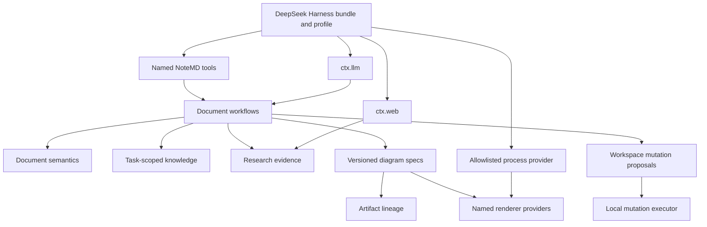

# DSH NoteMD 全量迁移架构

> English version: [2026-08-15-dsh-notemd-full-migration-architecture.md](2026-08-15-dsh-notemd-full-migration-architecture.md)

**状态：** 已批准的权威架构记录。若与先前 bundle 设计和 next-level runtime 中“默认直连 Provider、仅 source artifact”的结论冲突，以本文为准。

## 1. 决策

将 NoteMD 视为可审计的文档变换系统，而不是移植到 DeepSeek Harness 的 Obsidian 插件。DSH 负责生命周期、服务组合、Provider 凭据、LLM 路由、Web Provider 选择、Tool 注册和 profile 分层；NoteMD 负责文档语义、知识检索策略、证据记录、变更提案、工件谱系和面向目标的导出。

“全量迁移”定义为源提交 `4168a51cd19ad8c3d1e05f604b50936255461a31` 中全部非 Obsidian 宿主能力的行为契约对齐。它不包含 Obsidian UI、活动编辑器状态、Provider 设置和密钥，也不包含源工作树尚未提交的 Drawnix 改动。

目标基线为 `6672f54def2b05e1628786ace97ab73649edab74`。GitHub 仓库可更名为 `dsh-NotEMD`；npm 包名在明确批准兼容性迁移前保持不变。

## 2. 已核验的现状

| 领域 | 目标仓库证据 | 判断 | 必要修正 |
| --- | --- | --- | --- |
| 工作区写入 | `notemd-vault` 有内容寻址的文本 `WritePlan`；`LocalVault` 有预期修订、逐路径锁和同目录替换。 | 单文件基础可靠，但不是多文件事务。 | 增加文本/二进制/删除变更、journal 恢复、规范化多目标锁和显式 mutation receipt。 |
| 持久化作业 | `FileJobStore`、`DurableWorkflowRunner` 和具名计划作业保存 checkpoint 并恢复中断运行。 | 可复用的只规划基础。 | 保存 mutation proposal 与 evidence 引用，加入确定性目标选择和工作区 lease 策略。 |
| Cordis 生命周期 | bundle 使用 `Service`、`inject`，并为轮询扫描器和知识订阅清理使用 `ctx.effect()`。 | 方向正确。 | 为 HMR 做特征化测试，并把进程、staging、watcher 的有序清理收敛为单个 disposer。 |
| LLM | `ConfiguredTextTransformer` 自持 endpoint、model、API key 环境变量、诊断和模型发现。 | 违反 DSH 的职责边界。 | 默认 bridge 改为按 NoteMD route policy 消费 `ctx.llm.stream()`；OpenAI-compatible 仅保留为显式 legacy。 |
| 研究 | `planResearchSynthesis()` 接受调用方提供的字符串。 | 没有 native research 行为。 | 使用 `ctx.web.search()` 与 `ctx.web.fetch()`，保存类型化证据和引用。 |
| 知识库 | `VaultKnowledgeIndex` 按整个 Markdown 文件建索引，只返回标题/片段/分数。 | 仅部分检索。 | 恢复任务路径、段落锚点、滑动窗口、当前文件排除、检索诊断和可解释 context block。 |
| 文档 | 当前有基础 wiki link、翻译、标题、概念、Mermaid、公式工作流。 | 语义子集较窄。 | 迁移章节拆分、原文抽取、组合工作流、重复项协调和文件夹语义。 |
| 工件 | `DiagramSpec` 只有六种 intent；`SourceArtifactPlanner` 只写 JSON/README，`renderer: source`。 | 只有 source 持久化。 | 版本化 spec、source/preview/export 谱系、二进制资产、renderer provenance 与真实可用性结果。 |
| Tool 契约 | 所有 Tool 共用开放的 `objectOutput` schema。 | 已注册到 DSH，但输出不是 canonical contract。 | 每个具名 Tool 使用封闭的 success/conflict/rejected/unavailable 结果 schema。 |
| 导出 | 渲染/导出状态始终返回 unavailable。 | 诚实但未完成。 | 加入 SVG 目标、Draw.io、稳定 Drawnix、Circuitikz、Slidev、PDF、PNG、PPTX、MP4 provider。 |

已有实现不应推倒重来。路径边界、陈旧写入拒绝、持久化计划 checkpoint、审批收据与索引增量同步均应保留。

## 3. 来自 Koishi、Cordis 与 DSH 的约束

| 来源 | 在本架构中的约束 |
| --- | --- |
| Koishi cookbook | 只分配 Fiber 拥有的资源，完整释放；工作区状态不放入安装包。 |
| Cordis | 依赖显式服务，不依赖加载顺序或模块单例；只有独立替换或生命周期所有权真实存在时才创建 provider seam。 |
| DSH plugin model | 使用 `apply(ctx)`、静态 `inject`、运行时 config schema、Fiber-owned effect 和 schema-valid Tool 结果。 |
| DSH LLM | NoteMD 通过 DSH provider/model route 消费 `ctx.llm.stream()`，绝不读取 endpoint、header 或密钥。 |
| DSH web | NoteMD 通过 `ctx.web.search()` 与 `ctx.web.fetch()` 消费网络能力，遵守 DSH provider 选择，不自建回退传输。 |
| DSH bundle/profile | bundle 给出完整默认值；profile patch 替换 plugin 的整个 `config`，不假设深合并。 |
| DSH HMR | 注册、timer、进程、staging、订阅都必须是 Fiber effect；有顺序的清理放入一个 disposer，因为异步 disposer 可能并发执行。 |

## 4. 拓扑

包边界如下：

- `notemd-vault` 保持只读工作区事实边界。
- `notemd-mutation` 负责 mutation vocabulary、staging store、journal、恢复协议和 executor contract。
- `notemd-vault-local` 提供本地文件系统 executor，是唯一可变更工作区内容的包。
- `notemd-llm-dsh` 与 `notemd-research` 是 DSH consumer，而非传输所有者。
- `notemd-documents`、`notemd-knowledge`、`notemd-jobs` 分别负责确定性变换、检索与可恢复编排。
- `notemd-artifacts` 负责 `DiagramSpec`、渲染 contract、manifest lineage 与清理资格。
- 每个格式/依赖/安全语义不同的目标拥有具名 renderer/export 包；它们不能直接写工作区。
- `notemd-tools` 仅暴露具名操作，不提供 `notemd_run(type, options)` 之类的泛化调度器。

## 5. 核心契约

### 工作区变更

`WorkspaceMutationPlan` 替代仅文本的 `WritePlan`。计划不可变、内容寻址；每个操作绑定目标、预期修订、provenance 和冲突策略。`writeText` 与 `writeBytes` 还绑定 MIME、SHA-256，以及 inline text 或 staged asset reference。`delete` 绑定预期修订和旧摘要，不伪造 MIME。

执行器顺序为：根目录/路径校验、规范锁排序、同卷 staging、持久 journal 转换、单文件原子替换或 quarantine move、摘要复核和恢复。承诺可恢复与幂等恢复，不虚称跨文件 ACID。崩溃可留下未完成 journal，但不能留下无记录的成功变更。

规划、审批、应用必须是分离的具名操作。批处理作业只能产生 proposal，不能消费审批或写入。破坏性清理需要单独 proposal 与审批路径。

### LLM 与研究

`notemd-llm-dsh` 将 NoteMD 任务策略映射为 DSH 的 `provider`、`model`、token limit 和 prompt provenance，再从 DSH chunk stream 组装 canonical text。策略可选择 DSH route，但绝不包含 base URL、key、header 或 retry 实现。

`notemd-research` 通过 `ctx.web` 执行显式 search 与 fetch，保存 `ResearchEvidence`：查询、请求/最终 URL、HTTP 状态、截断状态、内容摘要、抓取时间、来源元数据和引用锚点。DSH 当前只提供 HTML/text fetch body；PDF 抽取必须 capability-gated，未安装 provider 时返回 `capability-unavailable` 才是正确行为。

### 文档、知识与批处理

Markdown 敏感变换必须使用 AST 和稳定段落锚点，不用纯正则做结构性改写。知识索引是派生数据，具有任务级根路径、段落文档、窗口扩展、可解释命中和可选当前文件排除。去重、章节再生成和 rename/delete 协调只产生 mutation proposal，不能直接调用文件系统。

批处理冻结已验证的目标列表，保存每目标 checkpoint，并使用确定性排序。生成可在隔离 staging 中并发，但 mutation 应用使用工作区规范锁顺序。重启后不自动恢复模型调用。

### 工件与渲染器

`DiagramSpec` 是版本化的可区分契约，包含 intent、结构化 graph/chart/circuit 数据、evidence reference、source digest、model/prompt provenance 与目标源。工件谱系记录 canonical source、preview/export 派生物、renderer version/theme/font input、MIME、输出摘要与可用性状态。

只有 Mermaid、Vega-Lite、JSON Canvas projection、HTML/SVG、editable HTML/SVG 和稳定 Drawnix 可以默认产出 SVG preview。SVG sanitizer 删除脚本、事件属性、远程资源和危险链接。Draw.io 需要兼容 renderer；Circuitikz 需要 `.tex` 和 Tectonic；PPTX 与 MP4 有独立 exporter。不得把 SVG fallback 标成精确 Draw.io、Circuitikz、PPTX 或视频等价物。

外部程序只能通过 allowlisted、argument-vector 的 process provider 在 staging 目录运行。禁止 shell interpolation、任意 executable、继承密钥和直接工作区写入。输出先哈希，再成为 mutation-plan asset。

## 6. 迁移矩阵

| 源能力族 | 目标处置 | 退出条件 |
| --- | --- | --- |
| Provider 诊断、profile 导入导出、连接测试 | 按设计排除，由 DSH 管理 Provider 和密钥。 | NoteMD 不再暴露重复的 endpoint/key 配置。 |
| Obsidian editor/command/modal/sidebar/preview host | 按设计排除。 | 可复用工作流接受显式 path/content 并返回 canonical data。 |
| Wiki link、标题、翻译、概念、公式、Mermaid | 已实现为具名 path/folder/batch planner。 | 源兼容 fixture、prompt 边界、输出策略和 mutation proposal 均由 source matrix 与 conformance gate 覆盖。 |
| 章节拆分、原文抽取、extract-and-generate、重复项协调 | 已实现为受管 ownership 与分离的 operation contract。 | manifest digest 保护、手工编辑冲突、显式输出策略和 checkpoint 批处理通过 fixture。 |
| 本地知识检索 | 已实现为可重建的 section-level retrieval。 | task-root 策略、section window、diagnostic 和 citation 由 knowledge/conformance 测试覆盖。 |
| 研究摘要 | 已通过持久化 `ctx.web` evidence 实现。 | search/fetch 由 DSH 选择 provider，带 citation 持久化，并且只通过 evidence id 消费。 |
| Mermaid、JSON Canvas、Vega-Lite、HTML、editable SVG | 已实现为具名 SVG-capable renderer。 | 仅对适用 target 生成 canonical source 与清洗后的 SVG preview/export。 |
| Draw.io、稳定 Drawnix、Circuitikz | 已实现为受保护的具名 provider。 | source fidelity、staging-only process policy、digest 校验和真实 unavailable 结果均有测试。 |
| Slidev HTML、PDF、PNG、PPTX、MP4 | 已实现为具名 staged exporter。 | source 绑定到 `github:Jacobinwwey/slidev` fork；每个 HTML/二进制 target 独立测试 capability、字节上限、cleanup 和失败路径。 |
| 当前 Drawnix cross-root、relation-lane WIP | 明确排除。 | 不使用任何未提交源文件或 fixture 作为 parity oracle。 |

## 7. 拒绝的捷径与风险

- 默认保留 `ConfiguredTextTransformer` 会产生第二套 Provider 和凭据语义，必须降为 legacy-only。
- 单一 renderer selector 或泛化 operation type 会隐藏安全与保真契约差异，具名操作是必要 API，而非仪式。
- 每文件 `Promise.all()` 无法安全实现章节清理、去重和二进制导出回滚，只能过渡性保留。
- 渲染可用性取决于环境。bundle 可以交付 provider 与测试，但不能承诺本机 executable 存在；能力报告是 parity 的一部分。
- 大范围复制源代码会重新引入 Obsidian UI/进程假设；应以特征化 fixture 保留行为而非宿主耦合。
- 源 Drawnix 改动未提交，作为基线会破坏可复现性。
- Slidev 固定使用 fork `github:Jacobinwwey/slidev`，revision 为 `bbcb2efae709c2ebaa96bda522cd6c192476817c`；不能静默替换为上游仓库。该 fork 的 standalone HTML 入口为 `index-standalone.html`，archive validator 同时接受旧版 `index.html` 以保持兼容。

## 8. 完成条件

仅当范围内矩阵在特征化 fixture 上全部通过、所有 Tool 输出满足封闭 schema、工作区恢复覆盖崩溃点、DSH profile/bundle/HMR 测试通过、外部 provider 缺失时如实返回，以及 clean profile 能安装 packed bundle 时，迁移才可宣称完成。每个 phase 后都必须以证据更新进度记录，而不能以预测替代结果。
