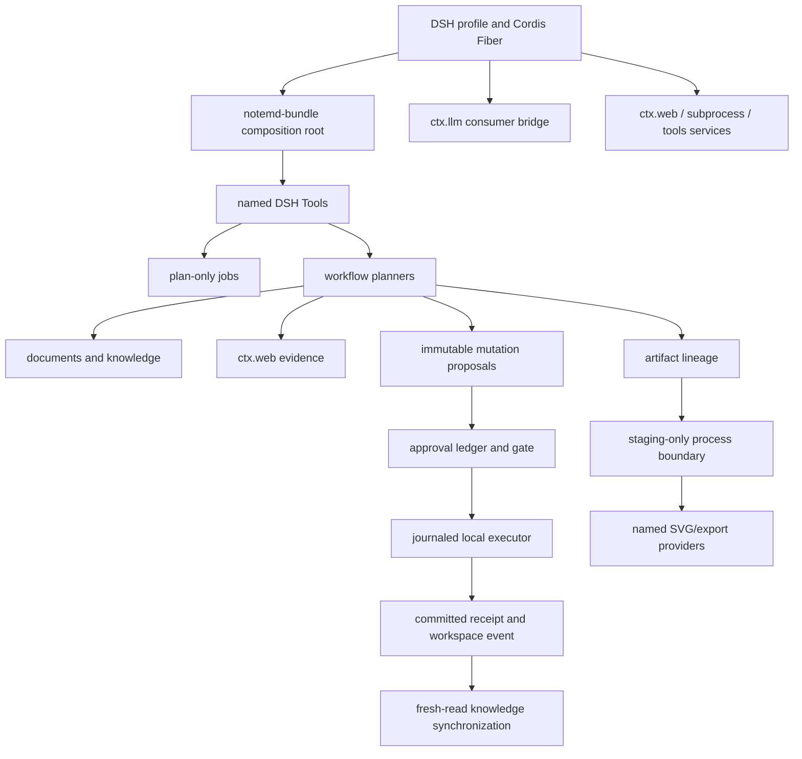

# DSH NoteMD Current-State Architecture Audit and Continuation Plan

> Chinese version: [2026-08-17-dsh-notemd-current-state-architecture-audit.zh-CN.md](2026-08-17-dsh-notemd-current-state-architecture-audit.zh-CN.md)

**Audit date:** 2026-08-17
**Target release:** `3169964` (`main`, `origin/main`); Phase 15-18 release evidence is historical, and Phase 19 records the composite architecture plan.
**Pinned source oracle:** `E:\convert\undo\obsidian-NoteMD_new` at `4168a51cd19ad8c3d1e05f604b50936255461a31`
**Source-intake candidate:** `cdf580c6c876190ecc1040caea08e5ba5bee004f` with a dirty checkout; see `fixtures/migration/source-intake-lock.json`.
**DSH reference:** `ref/deepseek-harness` at `47f943859bef60e4160492346772ded9b24f765a`
**Runtime:** Node `v22.19.0`, pnpm `10.7.1`

## Executive Assessment

The pinned eleven-phase migration is complete as a behavior-contract migration for the non-Obsidian-host scope. The published bundle has a single mutation authority, DSH-owned LLM/Web/tool lifecycle, named artifact providers, staged external processes, closed Tool schemas, bilingual evidence records, and a clean-profile acceptance path.

That conclusion is narrower than “every local runtime is installed and every source revision is mirrored.” The current acceptance suite proves deterministic contracts and truthful capability reporting. It does not claim that Playwright, the pinned Slidev fork, FFmpeg, Draw.io, Tectonic, or the optional Drawnix adapter are installed on every deployment. Those remain explicit environment capabilities.

The current source repository is not a valid new parity oracle: candidate commit `cdf580c6c876190ecc1040caea08e5ba5bee004f` is reproducible, but the checkout has five uncommitted Drawnix/planner paths. The intake lock compares the candidate with `4168a51`, records unchanged operation IDs and fixture hashes, and keeps all dirty/Drawnix paths quarantined. No candidate implementation is accepted by this release.

## 1. Implemented Architecture



| Boundary | Current owner | Evidence | Invariant |
| --- | --- | --- | --- |
| Composition and lifecycle | `packages/notemd-bundle` | Cordis `Service`, static `inject`, `ctx.effect()` | No module singleton owns timers, processes, subscriptions, or workspace state. |
| Workspace facts | `@notemd-harness/vault` | immutable revisions and path contracts | Read facts do not grant mutation authority. |
| Workspace mutation | `@notemd-harness/mutation` + `vault-local` | content-addressed plans, journal transitions, canonical locks, recovery | Only the local executor mutates workspace content. |
| Domain transformation | `documents`, `workflows`, `knowledge`, `research` | named operations and deterministic folder snapshots | Planning is pure with respect to workspace writes. |
| Permission and application | `tools`, `approval`, `runtime-adapter` | digest-bound one-time approval receipts | Jobs cannot approve or apply their own plans. |
| Artifact production | `artifacts`, renderer/export packages | source/preview/export lineage and v2/v3 manifests | Derivatives never replace canonical source. |
| External process | `notemd-process` | allowlisted executable, argv, staging root, byte and time bounds | No shell interpolation or direct final-path write. |
| DSH integration | `llm-dsh`, `research`, bundle patch | `ctx.llm`, `ctx.web`, optional DSH peers | Credentials, provider selection, and lifecycle remain DSH-owned. |

The two operational flows are intentionally separate:

```text
read -> immutable plan -> DSH approval -> journaled apply -> receipt -> event -> fresh-read index
source artifact -> staging process -> bounded bytes -> digest-verified asset -> approval-bound materialization
```

## 2. Reconciliation With Earlier Plans

| Earlier requirement | Current implementation | Assessment and remaining boundary |
| --- | --- | --- |
| 2026-08-14 standalone bundle design | Host-free bundle, explicit workspace root, package graph, profile patch, packed tarball | Delivered. Obsidian UI/editor/commands/modals/settings remain excluded by design. |
| Earlier generic OpenAI-compatible default | `notemd-llm-dsh` consumes `ctx.llm`; OpenAI-compatible code is an explicit legacy entry | Correctly superseded. The legacy package is still physically bundled for opt-in compatibility and should not be confused with the default route. |
| Next-level `WritePlan` and approval flow | `WorkspaceMutationPlan` plus journaled executor, receipts, recovery, and approval binding | Delivered with stronger multi-target semantics. It guarantees recoverability/idempotence, not filesystem-wide ACID. |
| Next-level durable jobs and scan events | `FileJobStore`, plan-only checkpoints, explicit resume, polling scanner, fresh-read index updates | Delivered for one workspace process. Cross-process job leases remain unsupported and documented. |
| Full plan Tasks 1-4 | Source matrix, mutation vocabulary, local executor, approval/events/jobs/tools | Contract and failure coverage are in place; no second write authority is retained. |
| Full plan Tasks 5-7 | DSH LLM/Web consumers, document semantics, section retrieval, folder policies | Delivered through named services and evidence-id-only durable research input. |
| Full plan Tasks 8-10 | DiagramSpec v2, artifact lineage, specialist providers, Slidev fork exporters | Delivered as capability-gated providers; real binaries are not assumed by the core bundle. |
| Full plan Task 11 | Conformance manifest, lifecycle tests, clean DSH profile, ordinary pushes to `origin/main` | Delivered. The conformance test is a fixture/proof gate, not a monolithic invocation of every source operation. |
| Source operation matrix | 29 source IDs, 18 included, 11 excluded-by-design, 14 fixtures, 4 baseline Drawnix-WIP exclusions; intake lock adds candidate `cdf580c6...` and five dirty paths | Registry IDs and migration fixture hashes are unchanged; candidate behavior remains audit-only and Drawnix remains quarantined. |
| Slidev requirement | `github:Jacobinwwey/slidev` at `bbcb2efae709c2ebaa96bda522cd6c192476817c`, `@slidev/cli@52.16.0` | Hard compatibility lock. Upstream Slidev is not interchangeable. |

## 3. Critical Gaps and Risks

### P0: Real-runtime evidence is separate from contract evidence

The tests use deterministic subprocess fakes and exercise unavailable branches. `accept:dsh` permits optional native capabilities to be either available or unavailable. This is the correct portable-core behavior, but it leaves a deployment-specific gap: there is no current evidence that the released fork archive, Playwright, FFmpeg, Draw.io, Tectonic, and Drawnix adapter work together on a real machine.

**Decision:** keep the core gate binary-independent; add a separate opt-in capability lane with pinned executable fingerprints, fixture exports, byte digests, and cleanup assertions. Never make optional binaries an implicit install dependency.

### P1: Conformance proof is strong but indirect

`migration-conformance.test.ts` verifies that every fixture has a test path and proof terms, then the ordinary Vitest suite executes those tests. It intentionally does not require one test per source operation because multiple operation IDs share semantic fixtures and `local-retrieval` is a required non-registry fixture.

**Decision:** preserve this gate, but evolve the manifest from free-form proof terms to typed executable fixture adapters with an explicit operation-to-fixture mapping. This removes source-text matching as the final proof mechanism.

### P1: Source drift is deliberately not migrated

The candidate source has committed diagram catalogs, gallery assets, response caching, render-target additions, and Mermaid normalization after `4168a51`, plus five dirty Drawnix/planner paths. Treating those edits as implicit requirements would violate the pinned oracle and reintroduce WIP ambiguity.

**Decision:** complete source intake as an audit-only lock: pin `cdf580c6...`, classify registry/fixture/category drift, and explicitly quarantine Drawnix. Mermaid normalization is a named follow-up candidate; no implementation changes are made from the dirty source tree alone.

### P1: Artifact contract versions are intentionally split but undocumented enough

`DiagramSpec` and diagram lineage use version `2`; document export manifests use version `3` because staged Slidev derivatives add different fields. The split is technically defensible, but a future consumer could mistake them for one global artifact schema.

**Decision:** add a schema registry document and runtime discriminators that state which version belongs to which artifact family. Do not collapse the versions merely for cosmetic uniformity.

### P2: One-workspace-process job safety

The file-backed job store and in-memory change bus are safe for one process, not a distributed scheduler. Two DSH instances sharing a workspace can race job execution even though mutation target locks protect individual writes.

**Decision:** retain the explicit single-process deployment contract for now; add a workspace execution lease or SQLite-backed job store only when multi-process operation becomes a requirement. Do not imply that per-file locks solve job-level duplication.

### P2: Legacy transport remains in the distribution boundary

The default patch does not load the OpenAI-compatible provider, and tests prove legacy Tools are absent from the DSH-only path. The package is nevertheless bundled as an explicit legacy export, which increases install surface and future maintenance cost.

**Decision:** keep it for compatibility in the current release; move it to a separately published compatibility package when the migration window closes. Removing it immediately would be a breaking package-surface change without user telemetry.

## 4. Trade-offs Kept Intentionally

- Named renderer/export providers are more verbose than a target selector, but they preserve target-specific fidelity, process allowlists, byte limits, and failure semantics.
- Staged assets survive service disposal when approval still references them; this consumes workspace state but prevents HMR from invalidating a pending approval digest.
- `FileJobStore` uses JSON replacement rather than a database; it keeps the bundle portable and inspectable, while the single-process limitation remains explicit.
- Source fixtures snapshot hashes and schemas, not generated prose; this avoids brittle LLM snapshots while still protecting mutation paths and artifact identity.
- SVG previews are useful for supported targets, but are never advertised as PPTX, MP4, Draw.io, or Circuitikz parity.

## 5. Concrete Continuation Plan

### Phase 12: Executable conformance adapters

**Owner:** `fixtures/migration`, `packages/notemd-workflows/test`, `packages/notemd-artifacts/test`.
**Work:** replace proof-term matching with typed fixture adapters; map every included operation ID to an executable fixture assertion; keep shared fixtures explicit.
**Exit:** the test fails when an operation mapping is deleted, a fixture adapter does not run, or an excluded operation re-enters without a reason.

### Phase 13: Real optional-runtime capability lane

**Owner:** `scripts`, `packages/notemd-process/test`, export/provider test fixtures, CI/profile configuration.
**Work:** run the pinned Slidev fork archive, Playwright, FFmpeg, Draw.io, Tectonic, and Drawnix adapter against deterministic decks/diagrams when binaries are installed; record executable fingerprints and output digests.
**Exit:** each installed capability produces its native artifact, passes staging cleanup and cancellation checks, and remains `unavailable` when the executable is intentionally removed.

### Phase 14: Artifact schema registry and migration policy

**Owner:** `packages/notemd-artifacts`, docs, verifier.
**Work:** publish a registry for `DiagramSpec v2`, diagram lineage v2, and document export manifest v3; add explicit family discriminators and forward-compatibility rules.
**Exit:** packed-bundle verification rejects unknown family/version combinations without rejecting valid v2/v3 artifacts.

### Phase 15: Workspace operations hardening

**Owner:** `notemd-jobs`, `notemd-workspace-events`, `notemd-vault-local`.
**Work:** use an explicit file-backed single-process guard for the current bundle; add structured owner lifecycle diagnostics, recovery counters, heartbeat, and cleanup health facts without introducing a scheduler/database.
**Exit:** a live second owner is rejected with a clear diagnostic, only a dead PID plus expired heartbeat is recoverable, and multi-process planning serialization is explicitly not claimed.

### Phase 16: Source-intake and Drawnix review

**Owner:** source matrix and paired architecture/progress records.
**Work:** pin the next source commit, diff registry IDs and semantic fixtures against `4168a51`, classify diagram-gallery/cache/render-target changes, and review each Drawnix WIP path separately.
**Exit:** `fixtures/migration/source-intake-lock.json` and the matrix intake link land before any new source behavior is implemented; the candidate has 29 unchanged operation IDs, no migration fixture hash drift, and named committed/dirty Drawnix quarantine paths.

### Phase 17: Remote-main parity review (2026-08-18)

The previous Phase 16 candidate (`cdf580c`) is now historical. The source remote `origin/main` is `6097ff1`, while the DSH release under audit is `92479bc`. Relative to the original `4168a51` contract baseline, the committed source drift is 194 files (+9,434/-6,770) across 17 commits; the source checkout has 17 uncommitted paths that remain excluded. The DSH release is therefore complete for its pinned non-host contract but only partially semantically aligned with current source-main diagrams, Mermaid normalization, Drawnix/Circuitikz convergence, and gallery/consumer evidence. No dirty source implementation is accepted by this audit.

Required next step: create a new source-intake lock for `6097ff1`, update typed fixtures/adapters, and keep DSH-owned provider cache policy and Obsidian host behavior outside the bundle boundary.

## 6. Recommended Order

1. Phase 12 is complete: typed executable adapters close the conformance proof gap.
2. Phase 13 is complete: optional native capability evidence remains separate from the portable gate.
3. Phase 14 is complete: mixed artifact versions have an explicit registry contract.
4. Phase 15 is complete for the current single-process deployment; add a durable lease only for a tested multi-process requirement.
5. Phase 16 is complete as audit-only intake; repeat it only for a new pinned source commit and never consume a dirty worktree as baseline.

The current release should not be reopened for Obsidian host UI, direct provider configuration, generic renderer selectors, or uncommitted Drawnix experiments. Those choices would weaken the ownership boundaries established by the sixteen-phase migration.

## 7. Progress-Record Protocol

Every continuation phase must update the paired English/Chinese progress files with:

- the source and target commit locks;
- exact files and service boundaries changed;
- measured test counts and capability limitations;
- rejected alternatives and new risks;
- the phase exit condition and next phase.

The architecture record is a decision log; the plan is executable work; the progress walkthrough is evidence. They must not be collapsed into one document or updated with forecasts presented as facts.
## 8. Phase 19 Composite workflow architecture review (2026-08-21)

- Current target lock: dsh-NotEMD main 3169964, npm dsh-notemd@0.1.1; source observation ref/obsidian-NotEMD@07c629c6f99a1171a6a63eaf50ddb0dce0f5fed5; historical oracle obsidian-NoteMD_new@4168a51cd19ad8c3d1e05f604b50936255461a31.
- Existing mutation, approval, journal, DSH LLM/Web, artifact, and single-process job foundations are reusable. No runtime composite implementation exists at this lock.
- Source workflowButtons.ts defines the three-step default chain, while NotemdSidebarView.ts:927-1160 carries hidden folder context. The DSH bundle has no named composite definition or explicit path request.
- Source batch title generation moves generated files to a complete folder, but planTitlesInFolder replaces files in place. Source Mermaid validation, report, and error-folder behavior is also absent from planMermaidRepairsInFolder.
- Current planners read the physical vault only. A virtual overlay, virtual revision validation, deterministic net-transition accumulator, and aggregate digest are required before a Tool or job surface is exposed.
- migration-fixture-adapters.ts still uses a synthetic DiagramSpec for diagram-source. This phase does not claim Markdown-to-intent inference or current remote-main diagram normalization parity.
- Decision: add pure @notemd-harness/composites, one-click-extract@1, fixed fail-fast semantics, optional mutation lineage, and a thin NotemdCompositeWorkflowService with static injection of notemdVault and notemdWorkflows. Reuse the existing approval receipt, FileJobStore, DurableWorkflowRunner, and journaled executor.
- Rejected: raw custom-workflow DSL, generic dispatcher, public continueOnError, immediate per-step apply, temporary workspace writes, and universal SVG parity.
- Execution plan: docs/superpowers/plans/2026-08-21-dsh-notemd-composite-workflow.md, eight tasks covering source fixtures, mutation lineage, overlay, atomic planners, Cordis integration, named Tools/jobs, acceptance, and release evidence.
- Phase status is planning-only: Architecture and implementation plan recorded. Runtime implementation not started in this phase. No composite Tool, job, package, or patch row is shipped at this lock.
- Next gate: implement source-faithful atomic batch planners and overlay tests first; only then add the named plan Tool and durable job. Keep Drawnix WIP and source diagram drift in audit-only lanes.
