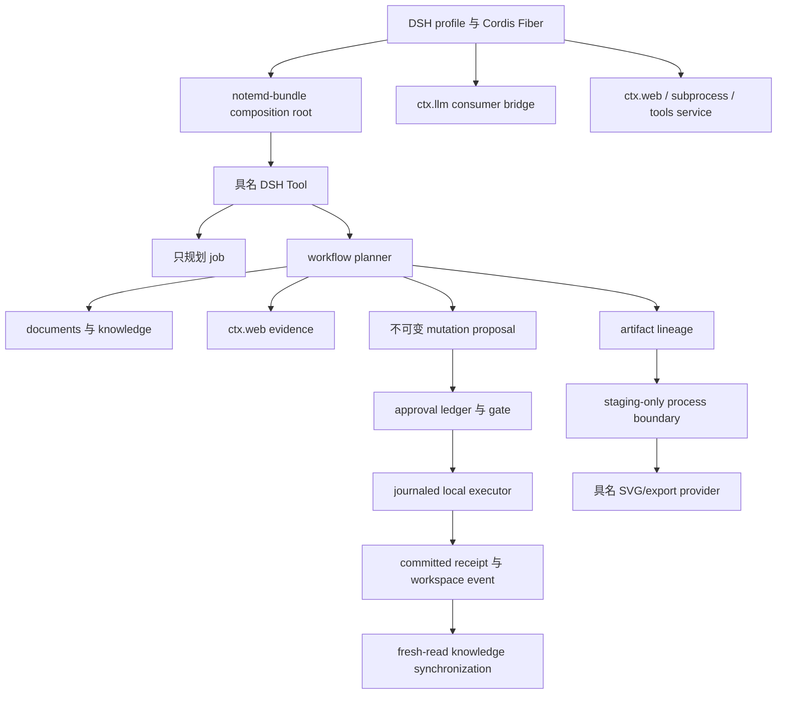

# DSH NoteMD 当前架构审计与后续实施方案

> English version: [2026-08-17-dsh-notemd-current-state-architecture-audit.md](2026-08-17-dsh-notemd-current-state-architecture-audit.md)

**审计日期：** 2026-08-17
**目标发布：** `488378fb6a1429683bf1789f418abca8992bd3a2`（`main`、`origin/main`）
**固定源行为 oracle：** `E:\convert\undo\obsidian-NoteMD_new`，提交 `4168a51cd19ad8c3d1e05f604b50936255461a31`
**DSH reference：** `ref/deepseek-harness`，提交 `47f943859bef60e4160492346772ded9b24f765a`
**运行时：** Node `v22.19.0`、pnpm `10.7.1`

## 结论

固定的十一阶段迁移已经在“非 Obsidian 宿主行为契约”范围内完成。已发布 bundle 具备唯一 mutation authority、DSH 所有的 LLM/Web/Tool 生命周期、具名 artifact provider、staging 外部进程、封闭 Tool schema、双语证据记录和 clean-profile acceptance。

这个结论不等于“所有本机 runtime 都已安装，也不等于当前源仓库最新状态已经镜像”。当前 acceptance suite 证明的是确定性 contract 与真实的 capability reporting，不是每台机器都安装了 Playwright、固定 Slidev fork、FFmpeg、Draw.io、Tectonic 或可选 Drawnix adapter。这些仍然是显式环境 capability。

当前源仓库不能直接作为新的 parity oracle：它已经到 `5efd4285f2d1861e725f520cfa8a02d1bf898eb7`，相对固定 baseline 又有一个提交，并且工作区包含大量已修改文件和未跟踪 diagram-gallery 资源。未重新固定 source commit 就迁移这些差异，会使结果不可复现。因此当前 bundle 正确地继续固定 `4168a51`，并隔离 Drawnix WIP。

## 1. 已实现架构



| 边界 | 当前 owner | 代码证据 | 不变量 |
| --- | --- | --- | --- |
| Composition 与生命周期 | `packages/notemd-bundle` | Cordis `Service`、静态 `inject`、`ctx.effect()` | module singleton 不拥有 timer、process、subscription 或 workspace state。 |
| Workspace fact | `@notemd-harness/vault` | immutable revision 与 path contract | 读取事实不授予 mutation authority。 |
| Workspace mutation | `@notemd-harness/mutation` + `vault-local` | content-addressed plan、journal transition、canonical lock、recovery | 只有 local executor 可以修改 workspace content。 |
| Domain transformation | `documents`、`workflows`、`knowledge`、`research` | 具名 operation 与确定性 folder snapshot | planning 对 workspace write 保持纯粹。 |
| Permission 与 application | `tools`、`approval`、`runtime-adapter` | digest-bound 一次性 approval receipt | job 不能批准或应用自己的 plan。 |
| Artifact production | `artifacts` 与 renderer/export package | source/preview/export lineage、v2/v3 manifest | derivative 不能替代 canonical source。 |
| External process | `notemd-process` | executable、argv、staging root、字节/时间限制 allowlist | 禁止 shell interpolation 与直接 final-path write。 |
| DSH integration | `llm-dsh`、`research`、bundle patch | `ctx.llm`、`ctx.web`、optional DSH peer | credential、provider selection 和 lifecycle 仍由 DSH 所有。 |

两个运行流保持分离：

```text
read -> immutable plan -> DSH approval -> journaled apply -> receipt -> event -> fresh-read index
source artifact -> staging process -> bounded bytes -> digest-verified asset -> approval-bound materialization
```

## 2. 与先前方案的对账

| 先前要求 | 当前实现 | 判断与剩余边界 |
| --- | --- | --- |
| 2026-08-14 standalone bundle 设计 | host-free bundle、显式 workspace root、package graph、profile patch、packed tarball | 已交付。Obsidian UI/editor/command/modal/settings 按设计排除。 |
| 早期 generic OpenAI-compatible default | `notemd-llm-dsh` 消费 `ctx.llm`；OpenAI-compatible 仅为显式 legacy entry | 已正确取代。legacy package 仍为 opt-in compatibility 而被物理打包，不能误认为默认 route。 |
| Next-level `WritePlan` 与 approval flow | `WorkspaceMutationPlan`、journaled executor、receipt、recovery 和 approval binding | 已交付更强的 multi-target 语义；保证 recovery/idempotence，不宣称 filesystem-wide ACID。 |
| Next-level durable job 与 scan event | `FileJobStore`、plan-only checkpoint、显式 resume、polling scanner、fresh-read index update | 已交付单 workspace process 场景；跨进程 job lease 仍不支持并已记录。 |
| Full plan Task 1-4 | source matrix、mutation vocabulary、local executor、approval/event/job/tool | contract 与 failure coverage 已落地，没有保留第二写入 authority。 |
| Full plan Task 5-7 | DSH LLM/Web consumer、document semantic、section retrieval、folder policy | 已通过具名 service 与仅 evidence-id 的 research durable input 交付。 |
| Full plan Task 8-10 | DiagramSpec v2、artifact lineage、specialist provider、Slidev fork exporter | 已按 capability gate 交付；core bundle 不假定真实 binary 存在。 |
| Full plan Task 11 | conformance manifest、lifecycle test、clean DSH profile、普通 push 到 `origin/main` | 已交付。conformance 是 fixture/proof gate，不是一次性单体调用所有 source operation。 |
| Source operation matrix | 29 个 source ID、18 included、11 excluded-by-design、14 fixture、4 组精确 Drawnix-WIP exclusion | 对固定 commit `4168a51` 已完成；source drift 必须先新建 lock 才能进入。 |
| Slidev 要求 | `github:Jacobinwwey/slidev`，revision `bbcb2efae709c2ebaa96bda522cd6c192476817c`，`@slidev/cli@52.16.0` | 硬兼容锁；上游 Slidev 不能互换。 |

## 3. 关键缺口与风险

### P0：真实 runtime 证据与 contract 证据分离

测试使用确定性 subprocess fake，并覆盖 unavailable 分支。`accept:dsh` 允许 optional native capability 为 available 或 unavailable。这是 portable core 的正确行为，但仍缺少一条部署级证据：当前没有证明真实 fork archive、Playwright、FFmpeg、Draw.io、Tectonic 和 Drawnix adapter 在同一机器上协同工作。

**决策：** core gate 保持 binary-independent；增加独立的 opt-in capability lane，记录 executable fingerprint、fixture export、output digest 和 cleanup。绝不把可选 binary 变成隐式安装依赖。

### P1：Conformance proof 强但间接

`migration-conformance.test.ts` 校验每个 fixture 都有 test path 与 proof terms，再由普通 Vitest suite 执行这些测试。它有意不要求每个 source operation 都有单独测试，因为多个 operation ID 共享语义 fixture，`local-retrieval` 还是必要的非 registry fixture。

**决策：** 保留现有 gate，但把 manifest 从自由文本 proof terms 演进为具类型的 executable fixture adapter，并明确 operation-to-fixture mapping，移除以 source text matching 作为最终 proof 的依赖。

### P1：Source drift 明确未迁移

当前 source 在固定 baseline 之后已有 committed delta，工作区还包含 diagram catalog、gallery asset、response cache、render-target 增量和 Drawnix 相关改动。把它们隐式当作需求会违反 pinned oracle，并重新引入 WIP 歧义。

**决策：** 增加 source-intake phase：先固定新的 source commit，再分类 registry 变化、刷新 fixture hash，并逐项接受或排除 Drawnix 变化。不能从 dirty source tree 直接实现。

### P1：Artifact contract version 已分裂，但文档不足

`DiagramSpec` 与 diagram lineage 使用 version `2`；document export manifest 使用 version `3`，因为 staged Slidev derivative 具有不同字段。分裂在技术上合理，但外部 consumer 可能误以为这是一个全局 artifact schema。

**决策：** 增加 schema registry 文档和 runtime discriminator，明确每个 version 所属 artifact family。不要为了形式统一而强行合并版本。

### P2：单 workspace process 的 job 安全边界

文件型 job store 与内存 change bus 只保证单进程，不是 distributed scheduler。两个 DSH instance 共享 workspace 时，即使 mutation target lock 能保护单文件写入，job execution 仍可能重复。

**决策：** 当前继续保留明确的 single-process deployment contract；只有多进程成为真实需求时，才引入 workspace execution lease 或 SQLite job store。不要误以为 per-file lock 已解决 job-level duplication。

### P2：Legacy transport 仍在 distribution boundary 内

默认 patch 不加载 OpenAI-compatible provider，测试也证明 DSH-only path 不注册 legacy Tool。但该 package 仍作为显式 legacy export 被打包，增加了安装面和维护成本。

**决策：** 当前 release 为兼容性保留；迁移窗口结束后拆为独立 compatibility package。立即删除会造成无 telemetry 支持的 breaking package-surface 变更。

## 4. 保留的权衡

- 具名 renderer/exporter 比 target selector 更冗长，但保留了目标特有的 fidelity、process allowlist、字节限制和失败语义。
- approval 仍引用 staged asset 时，service dispose 后必须保留该 asset；这增加 workspace state，但避免 HMR 让 pending approval digest 失效。
- `FileJobStore` 使用 JSON replacement 而不是 database，保持 bundle portable、可检查；single-process 限制必须继续显式化。
- source fixture 固定 hash 和 schema，不固定生成性 prose；避免脆弱 LLM snapshot，同时保护 mutation path 与 artifact identity。
- SVG 只对支持它的 target 作为 preview；绝不宣传为 PPTX、MP4、Draw.io 或 Circuitikz parity。

## 5. 具体后续实施计划

### Phase 12：Executable conformance adapter

**Owner：** `fixtures/migration`、`packages/notemd-workflows/test`、`packages/notemd-artifacts/test`。
**工作：** 用 typed fixture adapter 取代 proof-term matching；每个 included operation ID 绑定可执行 fixture assertion；共享 fixture 必须显式记录。
**出口：** 删除 operation mapping、fixture adapter 不可运行或未说明地重新纳入 excluded operation 时，测试必须失败。

### Phase 13：真实 optional-runtime capability lane

**Owner：** `scripts`、`packages/notemd-process/test`、export/provider fixture、CI/profile 配置。
**工作：** 当 binary 存在时，用固定 Slidev fork archive、Playwright、FFmpeg、Draw.io、Tectonic、Drawnix adapter 执行确定性 deck/diagram；记录 executable fingerprint 与 output digest。
**出口：** 每个已安装 capability 生成 native artifact，通过 staging cleanup/cancellation；主动移除 executable 时仍返回 `unavailable`。

### Phase 14：Artifact schema registry 与迁移策略

**Owner：** `packages/notemd-artifacts`、docs、verifier。
**工作：** 发布 `DiagramSpec v2`、diagram lineage v2、document export manifest v3 registry；增加 family discriminator 与 forward-compatibility 规则。
**出口：** packed-bundle verifier 拒绝未知 family/version 组合，同时接受合法 v2/v3 artifact。

### Phase 15：Workspace operations hardening

**Owner：** `notemd-jobs`、`notemd-workspace-events`、`notemd-vault-local`。
**工作：** 在 single-process guard 与 durable workspace lease 之间作出选择；增加结构化 job lifecycle diagnostic、recovery counter、cleanup health fact。
**出口：** 并发进程行为要么被清晰阻断，要么由经过测试的 lease backend 串行化；不得静默重复 model planning。

### Phase 16：Source-intake 与 Drawnix review

**Owner：** source matrix 与双语 architecture/progress record。
**工作：** 固定下一个 source commit，对比 `4168a51` 的 registry ID 与 semantic fixture，分类 diagram-gallery/cache/render-target 变化，并逐项审查 Drawnix WIP。
**出口：** 新 source lock 和 matrix commit 必须先存在，才能实现新的 source behavior；拒绝的 WIP 必须继续被命名和隔离。

## 6. 推荐顺序

1. Phase 12：间接 conformance proof 是当前最大 verification-quality gap。
2. Phase 13：用户真正关心 native export，而当前证据有意使用 fake/unavailable。
3. Phase 14：在外部 consumer 出现前，先固化混合 artifact version 的兼容契约。
4. Phase 15：仅在确实需要多进程部署时执行，不预先引入 database。
5. Phase 16：源项目产生新的 pinned commit 时执行；绝不把 dirty source worktree 当 baseline。

当前 release 不应重新引入 Obsidian host UI、直连 Provider 配置、generic renderer selector 或未提交 Drawnix experiment；这些做法会削弱十一阶段迁移已经建立的 ownership boundary。

## 7. 进度记录协议

每个后续 phase 都必须在中英文 progress 文件中记录：

- source 与 target commit lock；
- 变更的精确文件和 service boundary；
- 实测测试数量与 capability 限制；
- 被拒方案和新增风险；
- phase 出口条件与下一阶段。

Architecture 是决策日志，plan 是可执行工作，progress walkthrough 是证据。三者不能合并为一份文档，也不能把 forecast 写成 fact。
