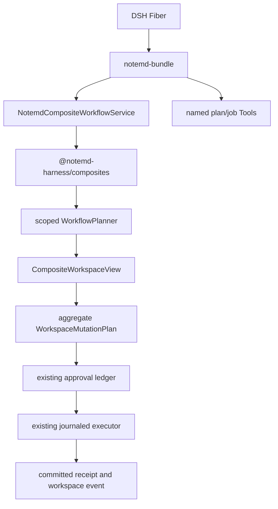

# DSH NoteMD Composite Workflow 顶层架构

> English version: 2026-08-21-dsh-notemd-composite-workflow-architecture.md

**决策状态：** `one-click-extract@1` 已实现；剩余边界是发布前完整 release gate。

**范围锁定：** 目标是可独立运行的 DeepSeek Harness bundle。Obsidian UI、编辑器、命令、Modal、设置与宿主生命周期留在 bundle 边界之外；LLM、Web、Provider、凭据与传输由 DSH 所有。

**证据锁：**

- 目标仓库：`dsh-NotEMD`，设计锁点为 main `3169964`；npm 包 `dsh-notemd@0.1.1`。
- 当前源观察点：`ref/obsidian-NotEMD@07c629c6f99a1171a6a63eaf50ddb0dce0f5fed5`。
- 历史行为 oracle：`obsidian-NoteMD_new@4168a51cd19ad8c3d1e05f604b50936255461a31`。
- Slidev 只接受 fork：`github:Jacobinwwey/slidev@bbcb2efae709c2ebaa96bda522cd6c192476817c`。

## 1. 决策

引入一个具名、类型化的 composite workflow：`one-click-extract@1`。

它是领域包，不是通用 action dispatcher。Definition 固化在 bundle 中，包含固定步骤顺序、固定 `fail-fast` 策略、definition digest 与显式 request schema。第一版只规划一个 aggregate `WorkspaceMutationPlan/v1`；approval 与 apply 继续复用现有一次性 receipt 和 journaled executor。

源插件默认链的语义为：

```text
process-current-add-links
  -> batch-generate-from-titles
  -> batch-mermaid-fix
```

源实现依赖 UI 隐式传递 concept folder 与最近生成的 complete folder。独立 DSH 运行时无法推断 active file、selected folder 或 Obsidian settings，因此 request 必须显式给出路径，后续步骤通过 virtual workspace overlay 获取前一步输出。

不迁入 source custom-workflow DSL。通用 action-list 会产生无界 Tool surface、隐藏 operation 兼容性并绕过步骤不变量；未来用户自定义 composite 必须是带 capability declaration 的新版本 definition。

## 2. 设计锁点缺口

设计锁点时的缺口包括：没有具名 composite definition 与 aggregate plan；title batch 还是原地替换而不是移入 complete folder；Mermaid batch 没有完整 validation、error move 与 report；步骤只能读物理 vault；一次 workflow 不能只获得一份 approval；diagram Markdown 到 intent 的推断仍是独立 parity gap。

这些是历史比对，不是当前实现状态。当前实测状态见第 11 节。

## 3. 目标与非目标

目标：保持 `read -> plan -> approve -> apply -> receipt` 链路；在无 Obsidian host context 时调用源默认 workflow；approval 前规划无副作用；让步骤顺序、失败策略、路径解析和 lineage 可审计、可摘要、可做 digest；只复用语义已证明一致的 atomic planner；job 仅在 workflow id、version、definition digest 一致时 resume；无 lineage 的旧 Plan 保持 digest 兼容。

非目标：执行 source custom-workflow DSL；迁移 UI 进度、Notice、选择对话框或 active-file discovery；新增通用 `notemd_run(type, options)`；在 NoteMD 中接管 Provider、凭据、endpoint、model discovery 或 Web transport；宣称多进程调度、全文件系统 ACID 或 universal SVG renderer parity；实现 dirty source checkout 中的 Drawnix WIP。

## 4. 拓扑与 ownership



- `@notemd-harness/composites` 依赖 workflows、mutation、vault；workflows 不反向依赖 composites。
- bundle 是唯一 Cordis composition root；纯 composites 包不创建 Context、Service、timer、process 或 global singleton。
- `NotemdCompositeWorkflowService` 使用静态注入 `notemdVault` 与 `notemdWorkflows`。
- Tool 调用 service；job 复用现有 `FileJobStore` 与 `DurableWorkflowRunner`，不新增 store 或 mutation executor。

## 5. 公共契约

```ts
export interface OneClickExtractRequest {
  readonly sourcePath: string
  readonly conceptFolderPath: string
  readonly completedFolderPath: string
  readonly mermaidFolderPath: string
  readonly mermaidErrorFolderPath?: string
  readonly idempotencyKey?: string
}

export interface CompositeWorkflowDefinition {
  readonly id: 'one-click-extract'
  readonly version: 1
  readonly definitionDigest: ContentSha256
  readonly failurePolicy: 'fail-fast'
  readonly steps: readonly CompositeStepDefinition[]
}

export interface ScopedWorkflowPlannerFactory {
  createScopedPlanner(vault: NotemdVault, beforeCompletion?: BeforeWorkflowCompletion): WorkflowPlanner
}
```

Tool/job edge 只做一次验证：路径必须是相对、slash-separated、无 NUL 的 workspace path；sourcePath 必须存在且为 Markdown；folder path 只 canonicalize 一次；destination collision 返回 closed error；v1 virtual dependency 只接受 text/Markdown。`beforeCompletion` guard 在每个 LLM request 前执行，由 overlay 负责 UTF-8 input budget，不改变 Provider ownership。

## 6. 步骤与聚合

1. `add-links` 调用现有单文档 link planner。
2. `generate-complete` 调用 source-faithful batch title planner，生成 Markdown、删除 source 副本并写入显式 complete folder；按 lexical 顺序处理，排除已经完成的目标，不复用语义不同的 `planTitlesInFolder`。
3. `repair-mermaid` 调用 source-faithful batch Mermaid planner；可写 repaired document、将 unresolved 文件移到 error folder、生成确定性 report，并显式拒绝同 basename destination collision。

Overlay lazy 读取 base document，保留原 revision/content digest；每个 mutation 对比 virtual revision；write 对后续步骤可见，delete 从 list 中消失；lineage 附着到 staged mutation；文件数、总 UTF-8 bytes 与每次 completion input 超限时 fail closed。virtual create 后再 delete 被归并为 net no-op。finalize 为每个 destination 生成一个净变更，最终仍通过 `createWorkspaceMutationPlan`。

## 7. Approval、job 与失败语义

- `notemd_plan_one_click_extract` 只返回一个 `WorkspaceMutationPlan/v1`。
- `notemd_job_start_one_click_extract` 只持久化 idempotency key、canonical paths、workflow id/version 和 definition digest，不保存凭据、endpoint、raw Web body 或无界 prompt。
- executor key 采用现有 `FileJobStore` 可接受的 `one-click-extract-v1`；record 另存 `workflowId`、`workflowVersion`、`definitionDigest`，definition drift 使用 `JOB_WORKFLOW_MISMATCH` fail closed。
- 一个 aggregate plan 只获得一份 approval receipt；步骤级 approval 不暴露。
- step error、cancel、virtual revision conflict、collision、budget overflow 或 unavailable dependency 都不返回可审批 partial plan。
- 不提供 public `continueOnError` flag；best-effort 必须是新的具名 definition、receipt 与 partial-result contract。

## 8. 向前兼容

- `WorkspaceMutationPlan.version` 保持 1；无 composite lineage 的旧 Plan 保持原 canonical digest。
- lineage 只包含 workflow id、version、definition digest、step id、ordinal；prompt 与 provider endpoint 不进入 digest。
- job workflow key 带 version，definition 改动不能静默 resume 旧 record。
- 新 failure policy、binary dependency 或 user-defined step 必须使用新的 workflow id/version 与 fixture，不得修改 `one-click-extract@1`。

## 9. 被拒方案与风险

拒绝 generic dispatcher、复用语义不一致的 folder planner、逐 step 立即 apply、overlay 写临时文件、把 orchestration 放入 Tool/job、把 SVG 当作通用 preview，以及 public `continueOnError`。主要残余风险是 LLM 输出造成 overlay 增长、v1 对已存在 complete destination 选择 collision 而不是 source skip、source remote-main 的 diagram/normalization drift，以及 FileJobStore 仍为 single-process。

## 10. 架构阶段出口

架构阶段已完成。配套 decision record 与 implementation plan 仍是设计锁点假设的权威来源；运行时证据单独记录在下方以及双语 progress/audit 文档中。README 首页不承载 implementation plan；runtime claim 必须有 focused conformance、aggregate approval、clean-profile acceptance 与完整 release gate 证据。

## 11. 实测运行时实现（2026-08-22）

- 已实现：`packages/notemd-composites`、`packages/notemd-mutation/src/composite-lineage.ts`、`packages/notemd-workflows` source-faithful batch planner、`packages/notemd-bundle` Cordis adapter/patch、`packages/notemd-tools` 具名 plan/job Tool、durable executor、确定性 fixture 与 clean-profile acceptance。
- Definition：`one-click-extract@1`，digest `66f0e111d94d98cec3bab1b00f7c8f72ab096c0a0a69d94061e2ac88c6e7ac4c`，步骤为 `add-links -> generate-complete -> repair-mermaid`，固定 `fail-fast`。
- 安全性：aggregate `WorkspaceMutationPlan/v1`、typed lineage、virtual read/list、revision conflict、approval 前不写盘、duplicate Mermaid error basename collision、virtual create/delete no-op、UTF-8 file/byte budget，以及每次 LLM request 前的 completion guard。
- 兼容性：job 使用 `one-click-extract-v1`，record 保留 `workflowId`、`workflowVersion`、`definitionDigest`，保持现有 FileJobStore contract 并对 definition drift fail closed。
- focused regression 已覆盖 source-faithful planner、overlay、accumulator、definition、Tool/job、lineage、approval，以及本轮新增的 duplicate destination、virtual create/delete 和 completion guard。
- 剩余 release gate：完整 typecheck、lint、test、coverage、build、pack/verify、clean DSH acceptance、`git diff --check`，随后提交并非强制 push `main`。Drawnix WIP、native binary renderer 与 source diagram normalization drift 仍排除。
